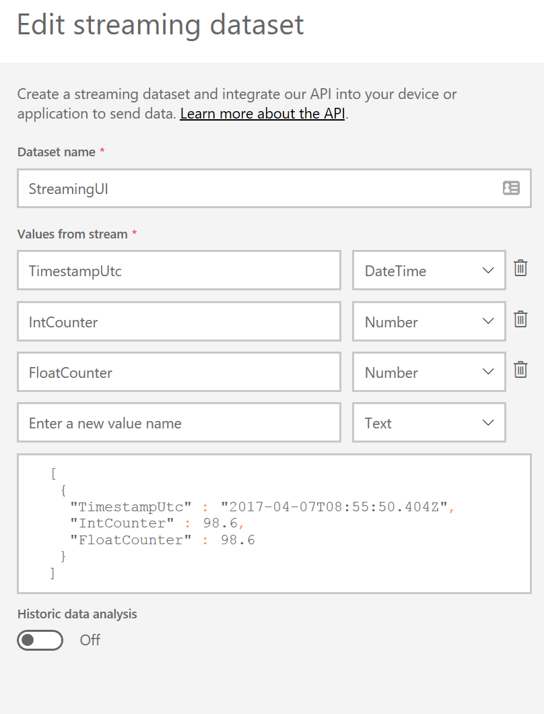

# Streaming Sample
Example of creating a streaming UI dataset and writing to it

# Device codes
In order to use this, create a streaming dataset using the [PowerBI web site](https://powerbi.microsoft.com/en-us/documentation/powerbi-service-real-time-streaming/).

The dataset should look like

Copy the URL and pass it as an argument to the application.

    dotnet run <url>

This will write to the data set every 5 seconds.
